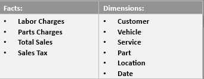

# Dimensional Model Design:

## Introduction

The tables form in this model are conceptually aligned with Kimball’s dimensional modeling principles and are well-suited for a data warehouse or an analytical database. They provide a structured way to analyze the car repair shop’s operations comprehensively.
## Requirements:
The model aims to satisfy the following general needs:
- Analyze the sales performance of our car repair centers.
- Locations across western Canada.
- Provide flexible analysis of sales of both services and parts by customer, vehicle
brand/model/year, and shop location.

## Information:
The Model was created Using the following key Pieces of Information from the
Sales Invoice:
### 1. Customer Information:
- Name: Identifies the customer.
- Address: Provides geographical data for analysis.
- Phone Number: Contact information for follow-ups and marketing.
### 2. Vehicle Information:
- Make: Brand of the vehicle.
- Model: Specific model of the vehicle.
- Year: Manufacture year of the vehicle.
- Color: Helps in identifying vehicles.
- VIN: Unique vehicle identifier.
- Registration Number: Another identifier for the vehicle.
- Mileage: Indicates the usage of the vehicle, which can correlate with service
needs.
### 3. Jobs Performed:
- Description: Details about the service performed.
- Hours: Labor hours spent on the service.
- Rate: Hourly rate for labor.
- Amount: Total labor charge for the service.
### 4. Parts Information:
- Part Number: Unique identifier for the part.
- Part Name: Descriptive name of the part.
- Quantity: Number of parts used.
- Unit Price: Cost per part.
- Amount: Total charge for the parts used.
### 5. Financial Information:
- Total Labor Charges: Sum of all labor charges.
- Total Parts Charges: Sum of all parts charges.
- Sales Tax Rate: Tax rate applied to the sale.
- Total Sales Tax: Total tax amount.
- Total Amount: Total invoice amount (labor + parts + tax).

## ER Diagram

## Model Crafting Process 
### 1.	Understanding Business Processes: (operational activities) performed by the car repair shop 
-	Customer Engagement and Intake 	• Customer Follow-Up 
-	Vehicle Inspection and Diagnosis 	• Operational Reporting and Analysis 
-	Service and Repair Operations 	• Marketing and Promotions 
-	Parts Management 	• Compliance and Record-Keeping 
-	Billing and Invoicing 
The key business processes that are relevant to the car repair shop, focusing on those that directly impact sales performance were Identified as shown above. 
### 2.	Defining the Grain: specifying exactly what a single row in the fact table should represent. 
-	The grain declared to be each individual service or part transaction provided during a customer’s visit. This is the most atomic level of data, capturing the finest detail available.  
### 3.	Identifying Dimensions: 
-	Customer: Information about the customer receiving the service. 
-	Vehicle: Details about the vehicle being serviced. 
-	Service: Description and details of the services performed. 
-	Part: Information about parts used during servicing. 
-	Location: Details about the shop location where the service was performed. 
-	Date: Time-related information to enable time-based analysis. 
-	Invoice: capturing invoice-specific details e.g. Invoice number. 
These dimensions are carefully chosen to allow slicing and dicing of the sales data in meaningful ways, aligning with Kimball's principle of "choosing dimensions that make sense for the business." 
### 4.	Designing Fact Tables: 
The Fact_Sales table captures key metrics related to each service or part transaction, including labor charges, parts charges, sales tax, and total sales amount. This table references the dimension tables via foreign keys.
### Identifying Facts and Dimensions 

# Table Structures and Explanations of Design Decisions 
## Fact Table: Fact_Sales 
This is the Model’s central table, capturing all the metrics needed for sales analysis.  It includes references to all relevant dimensions to enable detailed slicing and dicing of data. By storing Labor_Charge, Parts_Charge, Sales_Tax, and Total_Sales_Amount, it provides a comprehensive view of each transaction. 
-	Sales_ID: Unique identifier for each sale (Primary Key, INT, Auto Increment). 
-	Invoice_No Invoice number from the receipt. 
-	Customer_ID: Links to the customer who made the purchase (Foreign Key to Customer_Details, INT). 
-	Vehicle_ID: Links to the vehicle being serviced (Foreign Key to Vehicle_Details, INT). 
-	Service_ID: Links to the service performed (Foreign Key to Services, INT). 
-	Part_ID: Links to the parts used (Foreign Key to Parts, INT). 
-	Location_ID: Links to the location of the shop (Foreign Key to Location_Details, INT). 
-	Date_ID: Links to the date of the transaction (Foreign Key to Dates, INT). 
-	Labor_Charge: Cost of labor for services. 
-	Parts_Charge: Cost of parts. 
-	Sales_Tax: Sales tax applied. 
-	Total_Sales_Amount: Total amount of the sale. 
## Dimension Table: Customer_Details 
captures customer details, allowing analysis of sales by customer demographics. 
-	Customer_ID: Unique identifier for each customer (Primary Key, INT, Auto Increment). 
-	Name: Customer's name. 
-	Company: Customer's company. 
-	Address: Customer's address. 
-	Phone_No: Customer's phone number. 
## Dimension Table: Vehicle_Details 
includes vehicle-specific information, enabling analysis of sales by vehicle make, model, year, and mileage. 
•	Vehicle_ID: Unique identifier for each vehicle (Primary Key, INT, Auto Increment). 
•	Make: Vehicle make. 
•	Model: Vehicle model. 
•	Year: Vehicle year. 
•	VIN: Vehicle identification number. 
•	Reg_No: Vehicle registration number. 
•	Mileage: Vehicle mileage. 
## Dimension Table: Services 
Records details about the services performed, facilitating analysis of sales by service type. 
•	Service_ID: Unique identifier for each service (Primary Key, INT, Auto Increment). 
•	Description: Description of the service. 
•	Hours: Hours spent on the service. 
•	Rate: Rate charged for the service. 
## Dimension Table: Parts 
Tracks parts used in services, supporting analysis of parts sales and usage. 
•	Parts_ID: Unique identifier for each part (Primary Key, INT, Auto Increment). 
•	Part_No: Part number. 
•	Part_Name: Part name. 
•	Quantity: Quantity of the part used. 
•	Unit_Price: Unit price of the part. 
## Dimension Table: Location_Details 
Provides information about the shop locations, enabling geographical analysis of sales. 
•	Location_ID: Unique identifier for each location (Primary Key, INT, Auto Increment). 
•	Shop_Name: Name of the shop. 
•	Address: Address of the shop. 
## Dimension Table: Dates 
Includes date details, allowing time-based analysis of sales trends 
•	Date_ID: Unique identifier for each date (Primary Key, INT, Auto Increment). 
•	Date: Date of the transaction. 
•	Month: Month of the transaction. 
•	Year: Year of the transaction. 
 
## Explanations for Design Decisions: 
### 1.	Star Schema Design: 
-	The proposed model follows a star schema design, where the fact table (Fact_Sales) is at the center and is connected to multiple dimension tables. This design is simple, easy to understand, and performs well for read operations, which is a core tenet of Kimball’s methodology. 
### 2.	Fact Table Design: 
-	The fact table (Fact_Sales) is designed with a clear grain (each individual service or part transaction) and includes foreign keys to the dimension tables, which is consistent with Kimball's best practices. The fact table contains quantitative data (facts) that are directly related to the business process of sales transactions. 
### 3.	Dimension Table Design: 
-	Each dimension table contains descriptive attributes that provide context for the facts. These attributes allow for detailed analysis and reporting, adhering to Kimball's principle of creating conformed dimensions that are well-defined and consistent across the schema. 
### 4.	Handling of Dates: 
-	The inclusion of a date dimension (Dates) follows Kimball's recommendation of having a dedicated date dimension to support time-based analysis. This dimension allows for easy aggregation and filtering of data based on various time periods. 
### 5.	Additivity: 
-	The measures in the fact table (e.g., labor charge, parts charge, total sales amount) are additive, which means they can be summed across any of the dimensions. This property of additivity is crucial for accurate and meaningful aggregation in OLAP (Online Analytical Processing) systems. 
 
## Summary 
Through the design of this model, we have successfully: 
### 1.	Identified Key Pieces of Information from the Sales Invoice: 
Customer details, vehicle details, service details, part details, location details, and transaction details. 
### 2.	Identified Business Processes: 
Customer management, vehicle servicing, parts management, billing and invoicing, location management, and sales analysis. 
### 3.	Declared the Grain of the Fact Table: 
Each row in the Fact_Sales table represents a single transaction captured by an invoice. 
### 4.	Designed the Dimensional Model: 
Created an ER diagram depicting the fact table (Fact_Sales) and the associated dimension tables (Customer_Details, Vehicle_Details, Services, Parts, Location_Details, Dates). 
### 5.	Documented the Model: 
Provided descriptions of each table and column along with logical explanations of the design decisions. 
 

