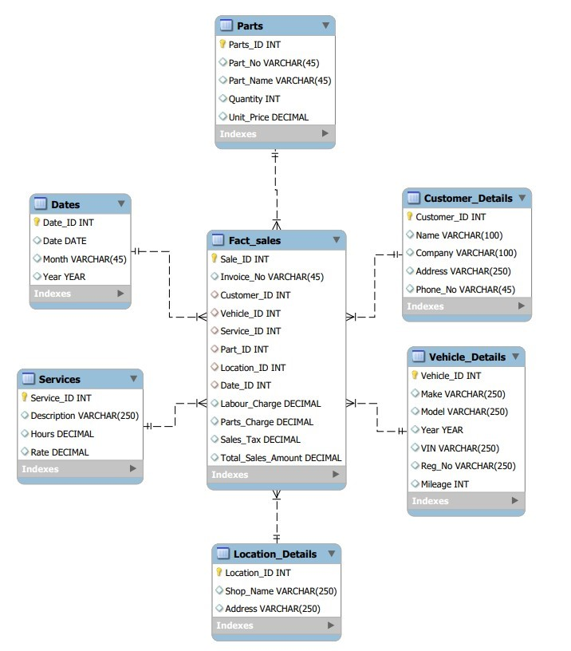

# Dimensional Model Design:

## Introduction

The tables form in this model are conceptually aligned with Kimball’s dimensional modeling principles and are well-suited for a data warehouse or an analytical database. They provide a structured way to analyze the car repair shop’s operations comprehensively.
## Requirements:
The model aims to satisfy the following general needs:
- Analyze the sales performance of our car repair centers.
- Locations across western Canada.
- Provide flexible analysis of sales of both services and parts by customer, vehicle
brand/model/year, and shop location.

## Information:
The Model was created Using the following key Pieces of Information from the
Sales Invoice:
### 1. Customer Information:
- Name: Identifies the customer.
- Address: Provides geographical data for analysis.
- Phone Number: Contact information for follow-ups and marketing.
### 2. Vehicle Information:
- Make: Brand of the vehicle.
- Model: Specific model of the vehicle.
- Year: Manufacture year of the vehicle.
- Color: Helps in identifying vehicles.
- VIN: Unique vehicle identifier.
- Registration Number: Another identifier for the vehicle.
- Mileage: Indicates the usage of the vehicle, which can correlate with service
needs.
### 3. Jobs Performed:
- Description: Details about the service performed.
- Hours: Labor hours spent on the service.
- Rate: Hourly rate for labor.
- Amount: Total labor charge for the service.
### 4. Parts Information:
- Part Number: Unique identifier for the part.
- Part Name: Descriptive name of the part.
- Quantity: Number of parts used.
- Unit Price: Cost per part.
- Amount: Total charge for the parts used.
### 5. Financial Information:
- Total Labor Charges: Sum of all labor charges.
- Total Parts Charges: Sum of all parts charges.
- Sales Tax Rate: Tax rate applied to the sale.
- Total Sales Tax: Total tax amount.
- Total Amount: Total invoice amount (labor + parts + tax).

## ER Diagram

## Model Crafting Process 
### 1.	Understanding Business Processes: (operational activities) performed by the car repair shop 
-	Customer Engagement and Intake 	• Customer Follow-Up 
-	Vehicle Inspection and Diagnosis 	• Operational Reporting and Analysis 
-	Service and Repair Operations 	• Marketing and Promotions 
-	Parts Management 	• Compliance and Record-Keeping 
-	Billing and Invoicing 
The key business processes that are relevant to the car repair shop, focusing on those that directly impact sales performance were Identified as shown above. 
### 2.	Defining the Grain: specifying exactly what a single row in the fact table should represent. 
-	The grain declared to be each individual service or part transaction provided during a customer’s visit. This is the most atomic level of data, capturing the finest detail available.  
### 3.	Identifying Dimensions: 
-	Customer: Information about the customer receiving the service. 
-	Vehicle: Details about the vehicle being serviced. 
-	Service: Description and details of the services performed. 
-	Part: Information about parts used during servicing. 
-	Location: Details about the shop location where the service was performed. 
-	Date: Time-related information to enable time-based analysis. 
-	Invoice: capturing invoice-specific details e.g. Invoice number. 
These dimensions are carefully chosen to allow slicing and dicing of the sales data in meaningful ways, aligning with Kimball's principle of "choosing dimensions that make sense for the business." 
### 4.	Designing Fact Tables: 
The Fact_Sales table captures key metrics related to each service or part transaction, including labor charges, parts charges, sales tax, and total sales amount. This table references the dimension tables via foreign keys. 

